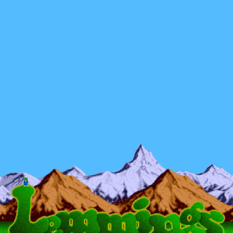

# Project's name
TributeToLemmings

## Description
As it was a bonus screen in the original Lemmings' game... WOW!! A simple skip bombs game!! Try to keep alive your Lemming as much you can!!!!

## MVP (DOM - CANVAS)
The MVP is simple: To create a game with one Lemming player, which has to skip failing bombs by using arrow commands and save the score of the amount of minutes alive. Our Lemming has 3 lifes, so it can resist to three collisions before dying.

We'll have 3 screens: Game start screen with a simple start button. Play Game screen (showing counter and lives left). And the Game Over screen with a restart button.

If iterations are completed, we'll add a Rank Screen (and also add button in Game Over screen to access to this page). Rank Screen should also have the restart button.

## Backlog
##### FIRST ITERATION:
Our first iteration will basically improve the UX of the game by:
1. *Adding status on character depending on lifes / collisions*
- 1st Bomb injured: A little hole will appear in the middle of the jersey.
- 2nd Bomb injured: We'll consider our lemming nearly death, so it'll have a skeleton face.
- 3rd Bomb injured: It'll die and exploit.

2. *Changing bombs depending on level*
- Level 1: Starting level will have a duration of 5 seconds.
- Level 2: Mid level, with a duration of 10 seconds, will increase the number of bombs x time.
- Level 3: Crazy level, with no limit of duration, will simply increase the speed, and maybe add stalactites as new kind of bomb.

##### SECOND ITERATION:
The second iteration will add the Ranking feature by:
1. Adding an input name in the Game Screen and saving that value with its score (seconds alive).
2. Adding a Ranking Screen after Game Over.
3. Highlighting player's position in the list.

##### THIRD ITERATION:
The third iteration is improving the UX via scenarios and screen flow's by:
1. Changing backgrounds depending on level (we'll need two more backgrounds, level 2 and 3).
2. Adding music.

## Data structure
Classes and methods definition.:

*Lemming*
1. Properties
  * canvas
  * ctx
  * image
  * image.src
  * dx
  * dy
  * dwidth
  * dheight
  * lives
  * direction
  * speed
  
2. Methods
  * setDirection
  * move
  * drawImage

*Bombs*
1. Properties
  * canvas
  * ctx
  * image
  * image.src
  * dx
  * dy
  * dwidth
  * dheight
  * speed
  * direction

2. Methods
  * move
  * drawImage

## States y States Transitions
Definition of the different states and their transition (transition functions)

*1. splashScreen*
  * create screen
  * start event (button)

*2. gameScreen*
  * create screen
  * game loop
  * count score & save data
  * display lives
  * update / move / clear
  * check collisions

*3. gameoverScreen*
  * create screen
  * display score
  * restart game
  
*4. rankingScreen (2nd Iteration)*
  * create screen
  * show rank list
  * highlight position in rank

## Task
Task definition in order of priority
1. Create screens
2. Create game loops
3. Create Player object
4. Create Enemy object
5. Player methods
6. Object methods
7. Test in canvas
8. Iterations

## Links

### Trello
[Link url](https://trello.com/b/m0jmTCtD)

### Git
URls for the project repo and deploy
[Link Repo](https://github.com/annacv/TributeToLemmings)
[Link Deploy](http://github.com)

### Slides
URls for the project presentation (slides)
[Link Slides.com](http://slides.com)
