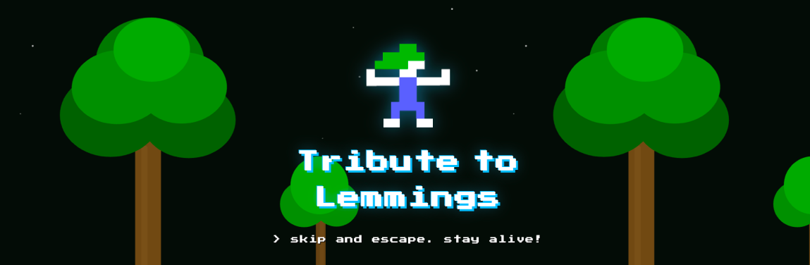

# Project's name
TributeToLemmings



## Description
As it was a bonus screen in the original Lemmings' game... WOW!! A classic skip-bomb game!! Try to keep alive your Lemming as much you can!!!!


## MVP (DOM - CANVAS)
The MVP is simple: To create a game with one Lemming player, which has to skip failing bombs by using arrow commands and save the score of the amount of minutes alive. Our Lemming has 3 lifes, so it can resist to three collisions before dying.

We'll have 3 screens: Game start screen with a simple start button. Play Game screen (showing counter and lives left). And the Game Over screen with a restart button.

If iterations are completed, we'll add a Rank Screen (and also add button in Game Over screen to access to this page). Rank Screen should also have the restart button.


## Backlog

##### ITERATION I — Visual Foundations & Brand Identity
Establish the visual and brand foundations that all subsequent iterations build on.
1. Replace JPG backgrounds with natively-designed layered SVGs (animatable, resolution-independent).
2. Redesign the splash screen as a branded "Tribute to Lemmings" hero screen with retro pixel typography and the lemming mascot.
3. Wrap the game canvas in a CRT/PC monitor bezel to establish the retro-computer aesthetic.
4. Make the canvas responsive so it scales up on large screens, no longer constrained by JPG resolution.
5. Programmatic body color: replace the three lemming SVG assets (one per health state) with a single SVG reference and draw the character directly on canvas, changing body/feet color via `ctx.fillStyle` based on lives remaining.
6. Blink on hit: when the player loses a life the lemming flashes (alternating visible/invisible frames) before settling into the new body color.
7. Hair animation: extra pixel groups adjacent to the main hair polygon are toggled on/off every few frames to simulate continuous hair movement.
8. Directional flip: the lemming faces right when moving right and left when moving left via a canvas horizontal mirror transform.
9. Lives icons: the lives counter displays one small lemming icon per remaining life. When a life is lost the corresponding icon blinks and fades out smoothly before being removed.

##### ITERATION II — Global Leaderboard
Add shared player identity and competitive scoring via an external data service (Firebase or Supabase free tier). localStorage-only storage is explicitly out of scope — a single-device ranking offers no competitive value.
1. Optional player name input on the splash screen; blank entry auto-assigns a guest handle (e.g. `Lemming #A3F`).
2. On game over, write `{ name, score (seconds alive), timestamp }` to the external collection.
3. Show a Ranking screen after Game Over with the global top-10 ordered by score descending.
4. Highlight the current player's row; show their global position even if outside the top 10.
5. Add a one-line data notice on the splash screen: "Your nickname and score will be saved to a public leaderboard."

##### ITERATION III — Sound & Music
Reinforce the emotional arc of each game moment with audio feedback sourced from the original Lemmings DOS OST.
1. Bomb hit SFX: a short explosion pop (300–500 ms) plays each time a bomb hits the player — the biggest audio gap in the current experience.
2. Game over sting: a distinct Lemmings DOS OST cue plays on the 2-second cinematic Game Over beat, which is currently completely silent.
3. Ranking screen ambient: a looping Lemmings DOS OST track on the Hall of Fame screen (nice-to-have; subject to finding a suitable track).
4. All new audio respects the existing `audio-muted` localStorage preference — muting during gameplay mutes SFX and all screens.
5. All assets sourced from the Lemmings DOS OST for tonal and legal consistency with the tribute concept.

##### ITERATION IV — Level Progression & Ground Erosion
Introduce difficulty escalation and the bridge mechanic to the tunnel world.
1. Dynamic level system: three discrete levels, each lasting 18 seconds (thresholds at 0/18/36 s survived). Level 1 starts with ~1 second between bomb spawns, decreasing per level to ~0.4 s at the final level. Bomb speed scales separately and more gradually.
2. Level transition UI with visual and audio cues at each level change; the game opens by announcing "Level 1" (visual only, no SFX), echoing the per-level intros of the original Lemmings.
3. Level-gated ground erosion: the ground becomes vulnerable only at the last level. Every miss etches a crack mark aligned with where the bomb fell, escalating in phases — light crack variants (1/2) first, heavier ones (3/4) from the fifth miss, and from the fifteenth miss each impact additionally punches a ground hole (4 variants cycling) until collapse. Before the last level, missed bombs exit the canvas harmlessly.
4. Warning at the start of the last level: an earthquake shake and a warning sting signal the ground is now vulnerable.
5. "Ground fully destroyed" trigger — when holes cover ~98% of the ground it collapses and transitions to the Tunnel World (Iteration V) via a `triggerTunnelWorld()` stub. Until Iteration V ships, this routes to a "TO BE CONTINUED" interstitial screen before Game Over.
6. Score is time-based and cumulative across screens. Difficulty level resets to 1 at each new screen.
7. Audio — level-up SFX: short ascending Lemmings DOS OST cue on each level transition; existing background track continues throughout.
8. Audio — ground crack SFX: low rumble each time a bomb chips the ground (last level only); one-shot ground collapse sting when the ground is fully destroyed and the transition fires.

##### ITERATION V — Tunnel Escape Puzzle
A new game screen with a puzzle mechanic: the player must blast their way out of an underground tunnel, across three escalating escape cycles.
1. Tunnel screen: underground environment with a confined layout, distinct from the surface game.
2. Retro-styled info modal explaining the new controls before play begins.
3. Unexploded bombs as pickable objects — one spacebar press picks one bomb.
4. Player explores the tunnel left/right to find a randomly-placed crack in the wall. Crack legibility decreases per cycle (cycle 1: crack-mark 1+2 combined; cycle 2: mark 2 alone; cycle 3: mark 1 alone — the subtlest read).
5. Place bombs at the crack, then light them with three spacebar presses (fuse animation + visual countdown). On touch devices a single contextual action button (label = current verb) replaces spacebar.
6. Explosion breaks the crack open — triggers the next escape cycle.
7. Three escape cycles per screen: after each successful escape, the ceiling lowers — and it keeps lowering throughout each cycle, so it can crush the lemming (the tunnel's only death source). Level differences: level 2 = new crack-mark appearance/placement + lower ceiling starting point; level 3 = the same + faster lowering velocity. Crack position randomizes each cycle to prevent memorization.
8. Crush death and respawn: with lives remaining, the cycle restarts with the ceiling back at that cycle's starting height, the remaining countdown time, the same crack-mark appearance, and a re-randomized crack position; the fuse is cancelled and carried/placed bombs are cleared. Losing the third life routes to Game Over with the banked score only. Levels 1–2 are tuned to be effectively un-lethal within the countdown budget (guarded by a unit test); only level 3 can crush inside it.
9. After completing all three cycles, the final breach blasts the floor pit open and the run ends right there (no in-tunnel pan into a new chamber); a Tunnel→Abyss transition screen then plays the collapse-shaft fall down and routes to the **win variant** of the end screen with the full both-worlds score count. Death keeps today's `GAME OVER` screen; `THE END` is reserved for its own later iteration (VII) as a dedicated finale screen. Until then, both variants route onward to the ranking.
10. Scoring — `TOTAL = surface seconds + tunnel seconds left (banked per cycle) + 5 × levels completed (surface levels completed + tunnel cycles completed)`. Lives are a continue resource only and never score — they reset each game, so a lives bonus would double-count survival, which time already pays for. The tunnel runs a visible 60s countdown that floors at 0 and never kills — the ceiling is the kill source; the countdown survives crush respawns (remaining time carries). A line-by-line count renders on the Game Over screen, each line showing the rule behind its points.
11. Audio — new looping background track on screen entry, distinct from the surface game track. All subsequent audio respects the existing mute gate.
12. Audio — SFX set: bomb pickup, light presses (match-strike per press ×3), fuse burn (looping tick during the lit fuse, stops on explosion or death), breach explosion (same meaning as on the surface: a bomb breaks earth), ceiling crush (on every life lost, shared with the surface collapse sting), ceiling lower between cycles (short grinding rumble), score count tick and total roll.

##### ITERATION VI — The Abyss: Horizontal Escape
A horizontal side-scroll escape through an underground corridor toward the exit door.
Art inspiration refs: `assets/images/backgrounds/refs/background-8.png`, `background-10.png`, `background-11.jpg`.
1. Cold open (door-in/door-out tribute, ratified in V's round-4 review): the Abyss arrival beat shows the lemming finding a closed door and entering the new world through it — doors open the chapter that THE exit door will close.
2. Horizontal rightward scroll: the lemming advances right through the corridor toward the iconic exit door (referencing the original Lemmings game) as the win condition.
3. Hazards along the corridor: stalactites as fixed ceiling obstacles the player navigates around; bombs fall from trigger zones as the player passes beneath them — two distinct hazard types, not simultaneous falling objects.
4. Player must dodge all hazards and reach the door to complete the screen. Ceiling sits close to the floor to maintain tension.
5. Ground starts visually damaged as a narrative callback to the erosion in Iteration IV.
6. New abyss-world SVG background designed for the underground setting.
7. On reaching the door: a brief (3–5s) non-interactive balloon escape cinematic plays — the lemming is lifted by the hot air balloon from the original Lemmings before the Ranking screen fades in.
8. Audio — new looping background track on screen entry: faster and more driving than the tunnel track to convey chase energy.
9. Audio — stalactite collision SFX (one-shot crunch on hit); door reached sting (triumphant one-shot on win condition); balloon cinematic track: the most iconic available Lemmings DOS OST cue, used as the emotional peak and payoff of the full game.

##### ITERATION VII — The End
A dedicated finale screen: the emotional close and win payoff of the full game. Split out from the Abyss (VI) on purpose so the ending — the screen players carry away — gets its own focus instead of being crammed into VI's plate.
1. Dedicated `TheEnd` screen with its own background art and dramaturgy (composition, pacing, copy, and likely a dedicated music cue).
2. Formalises the win ending: today the win routes through the parameterized `GAME OVER` *win* variant; `THE END` becomes a bespoke screen that replaces (or sits just ahead of) it — the exact placement relative to the Abyss balloon cinematic and the ranking is a scope-time decision. Death keeps the `GAME OVER` screen.
3. Sequencing & gate: ships after the Abyss (VI) — it is the beat the player reaches once the Abyss escape completes — and is blocked on the dedicated background artwork being provided (not generated).


## Data structure
Classes and methods definition.:

*Lemming*
1. Properties
  * canvas
  * ctx
  * image
  * image.src
  * dx
  * dy
  * dwidth
  * dheight
  * lives
  * direction
  * speed
  
2. Methods
  * setDirection
  * move
  * drawImage

*Bombs*
1. Properties
  * canvas
  * ctx
  * image
  * image.src
  * dx
  * dy
  * dwidth
  * dheight
  * direction
  * speed
  * isExploding

2. Methods
  * move
  * drawImage


## States y States Transitions
Definition of the different states and their transition (transition functions)

*1. splashScreen*
  * create screen
  * start event (button)

*2. gameScreen*
  * create screen
  * game loop
  * count score & save data
  * display lives
  * update / move / clear
  * check collisions

*3. gameoverScreen*
  * create screen
  * display score
  * restart game
  
*4. rankingScreen (2nd Iteration)*
  * create screen
  * show rank list
  * highlight position in rank

*5. toBeContiniuedScreen (4th Iteration stub)*
  * create interstitial screen
  * display "TO BE CONTINUED" in retro pixel style
  * route to gameoverScreen

*6. tunnelEscapeScreen (5th Iteration)*
  * create screen
  * display info modal on first entry
  * bomb pickup loop
  * crack detection
  * bomb placement + fuse sequence
  * cycle state (3 escapes, ceiling lowers per cycle + drifts down within each cycle, randomise crack position)
  * crush death + respawn (ceiling resets to cycle start height, countdown and crack appearance carry, crack position re-randomised)

*7. abyssScreen (6th Iteration)*
  * create screen
  * horizontal scroll loop
  * hazard placement (stalactites + bomb trigger zones)
  * collision detection
  * door win-condition check

*8. balloonEscapeScreen (6th Iteration endgame)*
  * non-interactive cinematic (~3–5s)
  * balloon lift animation
  * transition to rankingScreen

*9. theEndScreen (7th Iteration)*
  * create dedicated finale screen (own background + dramaturgy)
  * win-ending payoff (replaces / precedes the parameterized win variant)
  * route to rankingScreen


## Task
Task definition in order of priority
1. Create screens
2. Create game loops
3. Create Player object
4. Create Enemy object
5. Player methods
6. Object methods
7. Test in canvas
8. Iterations

## Development

### Prerequisites
Node 18+ and npm 9+.

### Setup
```bash
npm install
```

### Commands
| Command | Description |
|---|---|
| `npm run dev` | Start the Vite dev server at `http://localhost:5173` |
| `npm run build` | Bundle for production into `dist/` |
| `npm test` | Run the Vitest test suite |
| `npm run lint` | Type-check with `tsc` and lint with ESLint |

> **Note:** Open the game via `npm run dev`, not by double-clicking `index.html` — the file must be served through Vite for ES modules and asset paths to resolve correctly.

## Credits

Audio cues are sourced from the original Lemmings DOS OST (fan-tribute posture, tonal and legal consistency with the tribute concept). Iteration V adds the underground cave loop (`113_-_Lemmings_-_DOS_-_Tim_5.ogg`) and reuses the DOS SFX set (`EXPLODE`, `SCRAPE`, `FIRE`, `BANG`, `TENTON`, `CHAIN`, `TING`, `DIE`).

## Links

### [Link Repo](https://github.com/annacv/TributeToLemmings)
### [Link Deploy](https://annacv.github.io/TributeToLemmings/)
