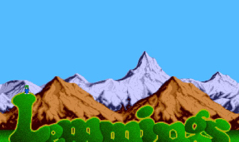

# Project's name
TributeToLemmings



## Description
As it was a bonus screen in the original Lemmings' game... WOW!! A classic skip-bomb game!! Try to keep alive your Lemming as much you can!!!!


## MVP (DOM - CANVAS)
The MVP is simple: To create a game with one Lemming player, which has to skip failing bombs by using arrow commands and save the score of the amount of minutes alive. Our Lemming has 3 lifes, so it can resist to three collisions before dying.

We'll have 3 screens: Game start screen with a simple start button. Play Game screen (showing counter and lives left). And the Game Over screen with a restart button.

If iterations are completed, we'll add a Rank Screen (and also add button in Game Over screen to access to this page). Rank Screen should also have the restart button.


## Backlog

##### ITERATION I — Visual Foundation & Brand Identity
Establish the visual and brand foundation that all subsequent iterations build on.
1. Replace JPG backgrounds with natively-designed layered SVGs (animatable, resolution-independent).
2. Redesign the splash screen as a branded "Tribute to Lemmings" hero screen with retro pixel typography and the lemming mascot.
3. Wrap the game canvas in a CRT/PC monitor bezel to establish the retro-computer aesthetic.
4. Make the canvas responsive so it scales up on large screens, no longer constrained by JPG resolution.

###### Iteration I Extra — Lemming Character Polish
5. Programmatic body color: replace the three lemming SVG assets (one per health state) with a single SVG reference and draw the character directly on canvas, changing body/feet color via `ctx.fillStyle` based on lives remaining.
6. Blink on hit: when the player loses a life the lemming flashes (alternating visible/invisible frames) before settling into the new body color.
7. Hair animation: extra pixel groups adjacent to the main hair polygon are toggled on/off every few frames to simulate continuous hair movement.
8. Directional flip: the lemming faces right when moving right and left when moving left via a canvas horizontal mirror transform.

##### ITERATION II — Ranking & Gameplay Completeness
Add persistent player identity and scoring.
1. Add a player name input on the start screen.
2. Save player name and score (seconds alive) to localStorage.
3. Show a Ranking screen after Game Over with an ordered leaderboard.
4. Highlight the current player's position in the ranking list.

##### ITERATION III — Level Progression & Ground Erosion
Introduce difficulty escalation and the bridge mechanic to the tunnel world.
1. Dynamic level system: bombs spawn faster and more frequently as levels increase.
2. Level transition UI with visual and audio cues between levels.
3. Ground erosion: bombs progressively destroy the ground layer visually over time.
4. "Ground fully destroyed" trigger — transitions the player to the Tunnel World (Iteration IV).

##### ITERATION IV — Tunnel Escape Puzzle
A new game screen with a puzzle mechanic: the player must blast their way out of an underground tunnel.
1. Tunnel screen: underground environment with a confined layout, distinct from the surface game.
2. Retro-styled info modal explaining the new controls before play begins.
3. Unexploded bombs as pickable objects — one spacebar press picks one bomb.
4. Player explores the tunnel left/right to find a crack in the wall.
5. Place bombs at the crack, then light them with three spacebar presses (fuse animation + visual countdown).
6. Explosion breaks the crack open and triggers the transition to the Abyss (Iteration V).

##### ITERATION V — The Abyss: Bombs & Stalactites
An enriched dodge game set underground, with a degrading environment.
1. Combined dodge mechanic: falling bombs and falling stalactites simultaneously.
2. Bombs that hit the ground create permanent holes — traversal hazards for the lemming.
3. Stalactites that land get nailed to the ground — permanent vertical obstacles.
4. Ground starts visually damaged as a narrative callback to the erosion in Iteration III.
5. New abyss-world SVG background designed for the underground setting.


## Data structure
Classes and methods definition.:

*Lemming*
1. Properties
  * canvas
  * ctx
  * image
  * image.src
  * dx
  * dy
  * dwidth
  * dheight
  * lives
  * direction
  * speed
  
2. Methods
  * setDirection
  * move
  * drawImage

*Bombs*
1. Properties
  * canvas
  * ctx
  * image
  * image.src
  * dx
  * dy
  * dwidth
  * dheight
  * direction
  * speed
  * isExploding

2. Methods
  * move
  * drawImage


## States y States Transitions
Definition of the different states and their transition (transition functions)

*1. splashScreen*
  * create screen
  * start event (button)

*2. gameScreen*
  * create screen
  * game loop
  * count score & save data
  * display lives
  * update / move / clear
  * check collisions

*3. gameoverScreen*
  * create screen
  * display score
  * restart game
  
*4. rankingScreen (2nd Iteration)*
  * create screen
  * show rank list
  * highlight position in rank


## Task
Task definition in order of priority
1. Create screens
2. Create game loops
3. Create Player object
4. Create Enemy object
5. Player methods
6. Object methods
7. Test in canvas
8. Iterations

## Development

### Prerequisites
Node 18+ and npm 9+.

### Setup
```bash
npm install
```

### Commands
| Command | Description |
|---|---|
| `npm run dev` | Start the Vite dev server at `http://localhost:5173` |
| `npm run build` | Bundle for production into `dist/` |
| `npm test` | Run the Vitest test suite |
| `npm run lint` | Type-check with `tsc` and lint with ESLint |

> **Note:** Open the game via `npm run dev`, not by double-clicking `index.html` — the file must be served through Vite for ES modules and asset paths to resolve correctly.

## Links

### [Link Repo](https://github.com/annacv/TributeToLemmings)
### [Link Deploy](https://annacv.github.io/TributeToLemmings/)
